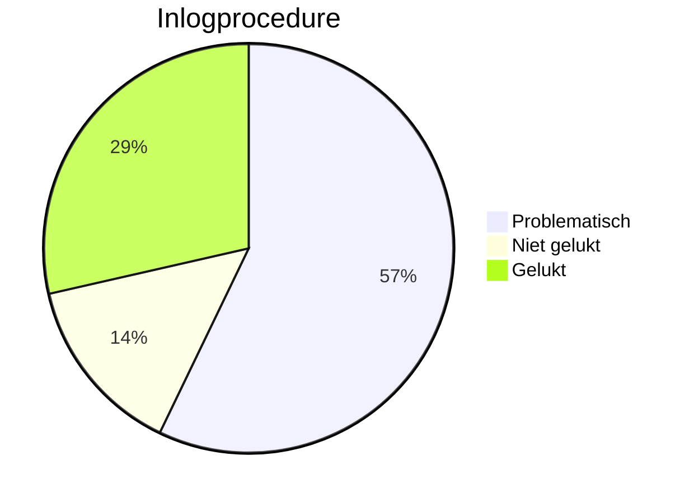
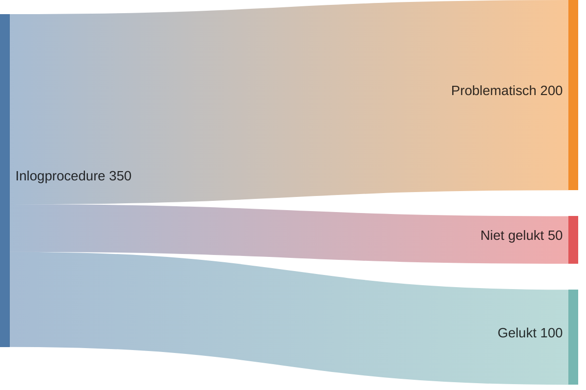
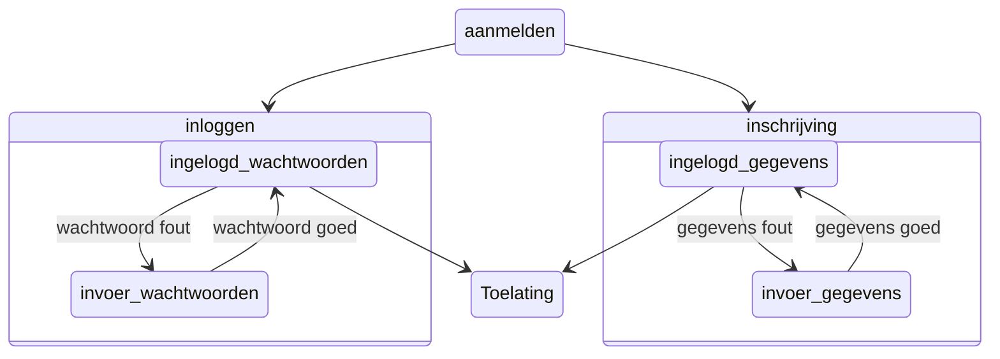
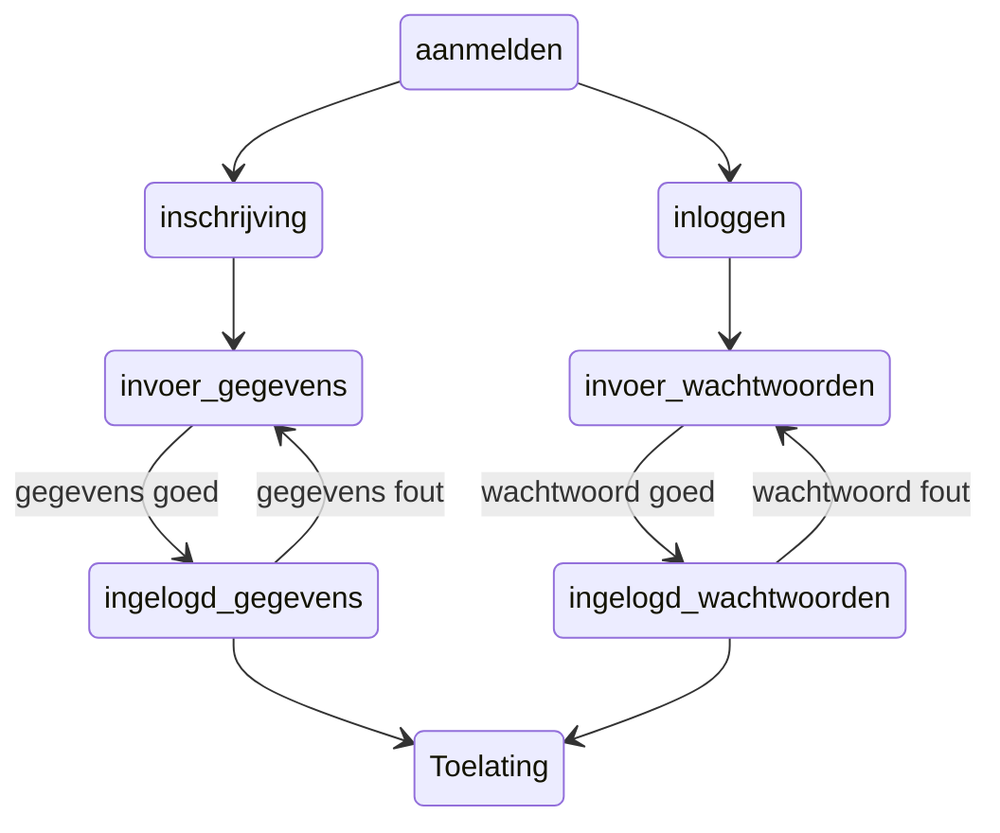
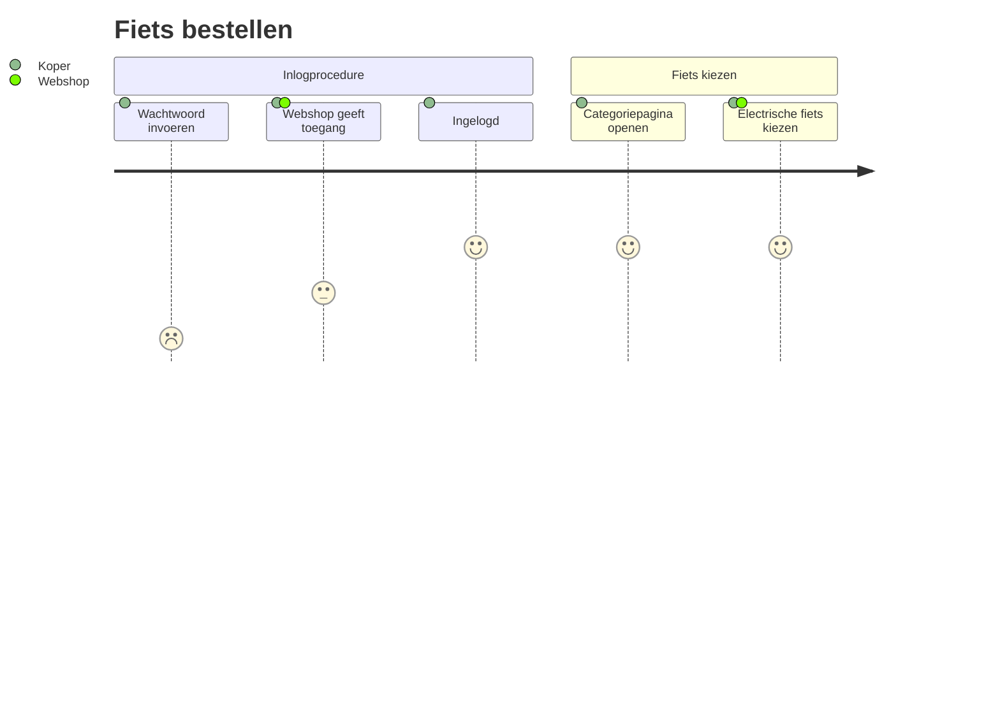

## Wachtwoord inlog resultaat


## Happy flow voorbeeld met boxen
```pre
stateDiagram-v2
    aanmelden --> inloggen
    aanmelden --> inschrijving

    state inloggen {
    ingelogd_wachtwoorden --> invoer_wachtwoorden : wachtwoord fout
    invoer_wachtwoorden --> ingelogd_wachtwoorden : wachtwoord goed
       }

    state inschrijving {
    ingelogd_gegevens --> invoer_gegevens : gegevens fout
    invoer_gegevens --> ingelogd_gegevens : gegevens goed
       }

    ingelogd_gegevens -->  Toelating
    ingelogd_wachtwoorden -->  Toelating
```


## Happy flow zonder boxen
```pre
stateDiagram-v2
    aanmelden --> inloggen
    aanmelden --> inschrijving

  inloggen --> invoer_wachtwoorden
    ingelogd_wachtwoorden --> invoer_wachtwoorden : wachtwoord fout
    invoer_wachtwoorden --> ingelogd_wachtwoorden : wachtwoord goed
       
inschrijving --> invoer_gegevens
    ingelogd_gegevens --> invoer_gegevens : gegevens fout
    invoer_gegevens --> ingelogd_gegevens : gegevens goed
       

    ingelogd_gegevens -->  Toelating
    ingelogd_wachtwoorden -->  Toelating
```



## Customer journey voorbeeld

```pre
journey
    title Fiets bestellen
    section Inlogprocedure
      Wachtwoord invoeren: 1: Koper
      Webshop geeft toegang: 3: Koper, Webshop
      Ingelogd: 5: Koper
    section Fiets kiezen
      Categoriepagina openen: 5: Koper
      Electrische fiets kiezen: 5: Koper, Webshop
```


