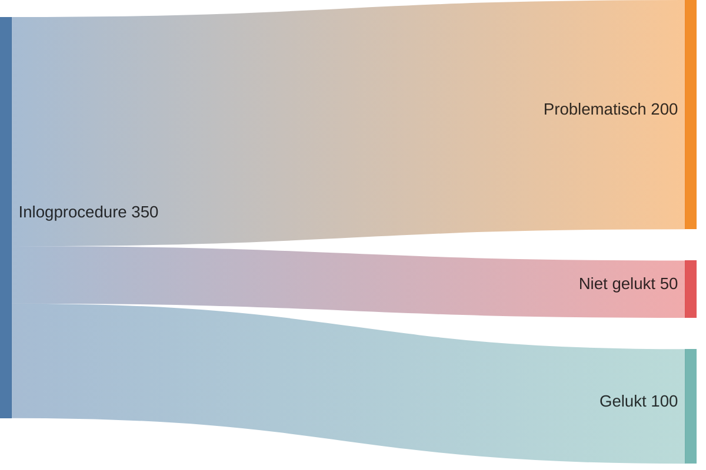
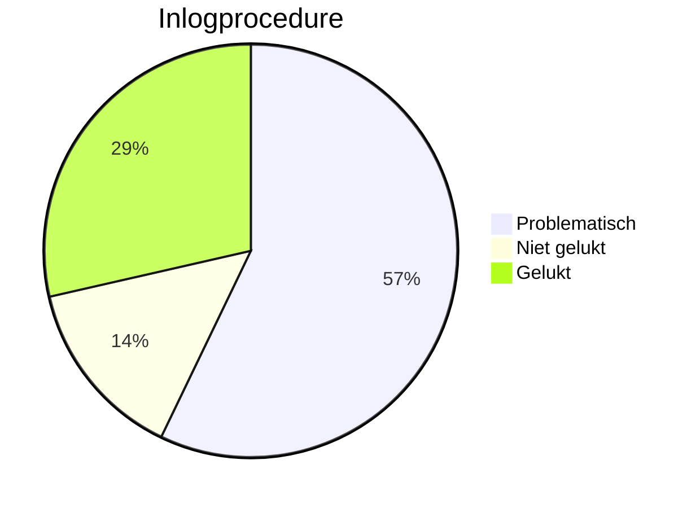
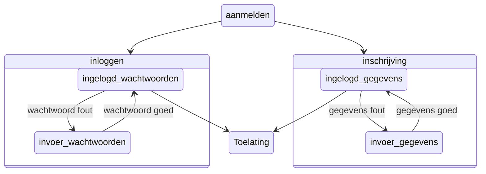
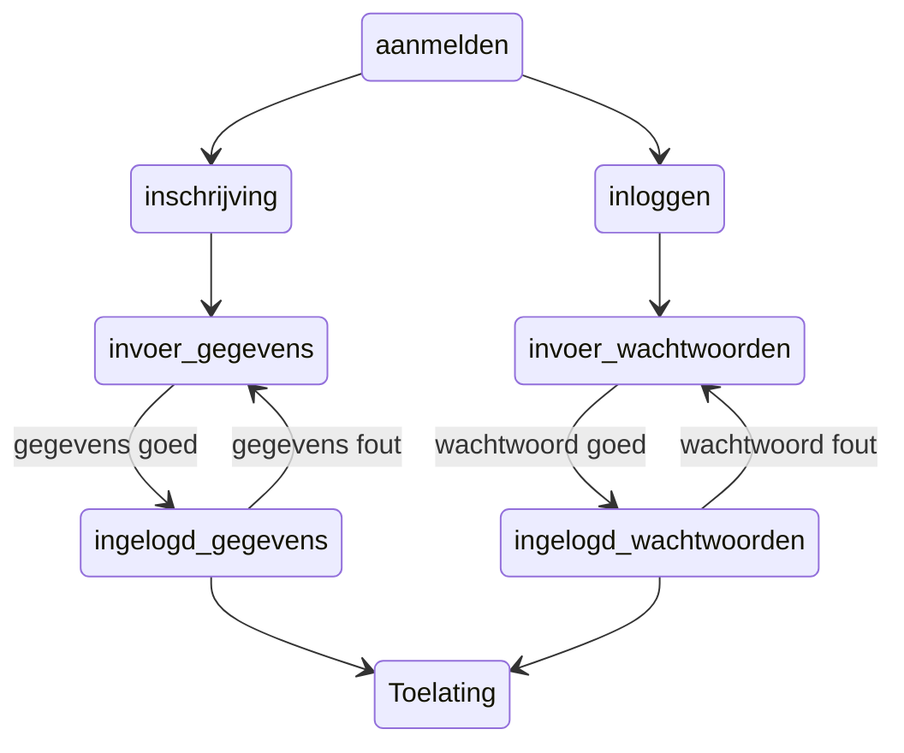
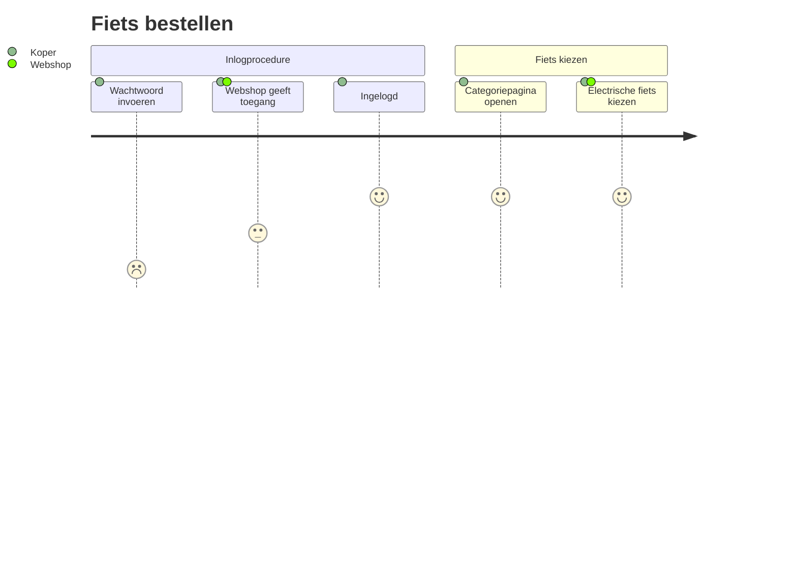
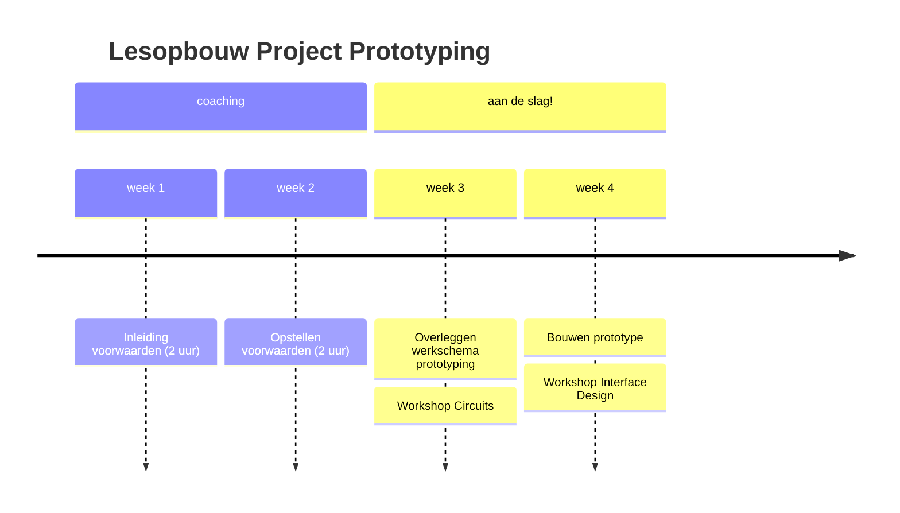
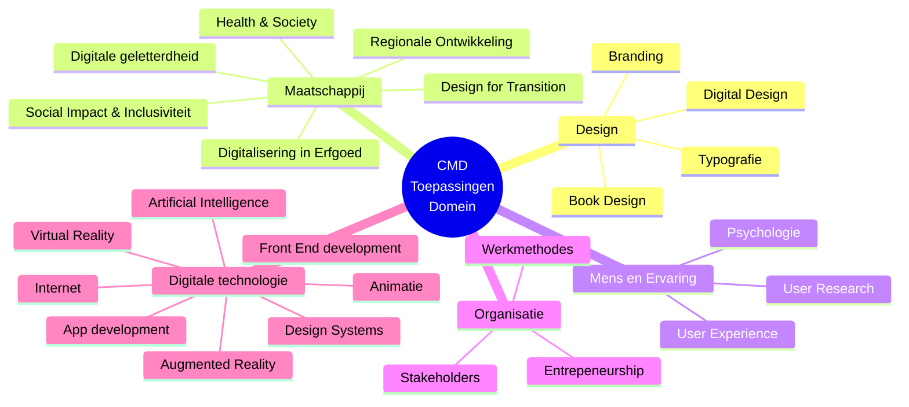

# Automatische data visualisaties met Mermaid
Deze pagina bevat voorbeelden van de meest gangbare toepassingen van **Mermaid**. Mermaid is opmaakcode waarbij je ingewikkelde diagrammen en tabellen in een handomdraai kan visualiseren op een vrij simpele manier: door gewoon in tekst (code) te typen wat je in de infographic wil zien! Je typt de labels en de data aantallen en Mermaid tekent automatisch de diagrammen voor je! Handig voor studenten bij UXE: Je kan de verzamelde data van je research meteen snel weergeven zonder een tekenprogramma te openen.

## Sankey Flow diagram
```pre
sankey-beta
Inlogprocedure, Problematisch, 200
Inlogprocedure, Niet gelukt, 50
Inlogprocedure, Gelukt, 100
```



## Pie Chart diagram
```pre
pie title Inlogprocedure
    "Problematisch" : 200
    "Niet gelukt" : 50
    "Gelukt" : 100
```



## Happy flow met boxen

```c
stateDiagram
    aanmelden --> inloggen
    aanmelden --> inschrijving

    state inloggen {
    ingelogd_wachtwoorden --> invoer_wachtwoorden : wachtwoord fout
    invoer_wachtwoorden --> ingelogd_wachtwoorden : wachtwoord goed
       }

    state inschrijving {
    ingelogd_gegevens --> invoer_gegevens : gegevens fout
    invoer_gegevens --> ingelogd_gegevens : gegevens goed
       }

    ingelogd_gegevens -->  Toelating
    ingelogd_wachtwoorden -->  Toelating
```


## Happy flow zonder boxen

```c
stateDiagram-v2
    aanmelden --> inloggen
    aanmelden --> inschrijving

  inloggen --> invoer_wachtwoorden
    ingelogd_wachtwoorden --> invoer_wachtwoorden : wachtwoord fout
    invoer_wachtwoorden --> ingelogd_wachtwoorden : wachtwoord goed
       
inschrijving --> invoer_gegevens
    ingelogd_gegevens --> invoer_gegevens : gegevens fout
    invoer_gegevens --> ingelogd_gegevens : gegevens goed
       

    ingelogd_gegevens -->  Toelating
    ingelogd_wachtwoorden -->  Toelating
```



## Customer journey voorbeeld

```c
journey
    title Fiets bestellen
    section Inlogprocedure
      Wachtwoord invoeren: 1: Koper
      Webshop geeft toegang: 3: Koper, Webshop
      Ingelogd: 5: Koper
    section Fiets kiezen
      Categoriepagina openen: 5: Koper
      Electrische fiets kiezen: 5: Koper, Webshop
```



## Tijdlijn voorbeeld

```pre
timeline
  title Lesopbouw Project Prototyping
  section coaching  
      week 1 : Inleiding voorwaarden (2 uur)
      week 2 : Opstellen voorwaarden (2 uur)
  
                        
section aan de slag!
   week 3 : Overleggen werkschema prototyping
          : Workshop Circuits
   week 4 : Bouwen prototype
          : Workshop Interface Design 
```


## Mindmap voorbeeld
```pre
      mindmap
      root((CMD<br>Toepassingen<br>Domein))
         Design
            Book Design
            Branding
            Typografie
            Digital Design
         Maatschappij
            Design for Transition
            Digitale geletterdheid
            Social Impact & Inclusiviteit
            Digitalisering in Erfgoed
            Regionale Ontwikkeling
            Health & Society
         Mens en Ervaring
            Psychologie
            User Experience
            User Research
         Organisatie
            Entrepeneurship
            Stakeholders
            Werkmethodes
         Digitale technologie
            Augmented Reality
            Virtual Reality
            Design Systems
            Animatie
            Artificial Intelligence
            Front End development
            App development
            Internet
```



